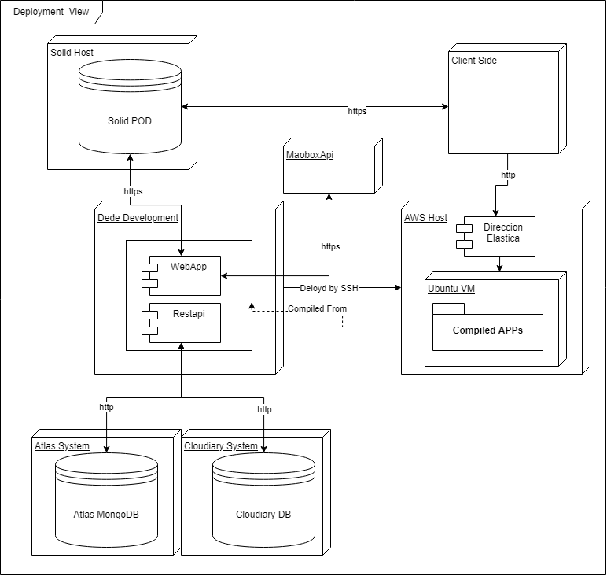

[[section-deployment-view]]

== Deployment View

[role="arc42help"]

=== Elements
[cols="1,1"]
|===
|Artifact |Description

|DEDE development
|Where DEDE development takes place, standard computer with REACT and Node.

|Device
|A host to React, normally the same computer as development

|Solid Pods
|The user PODs that must be configurated

|Browser
|To comunicate with the Device, must be a mallor browser
|===
