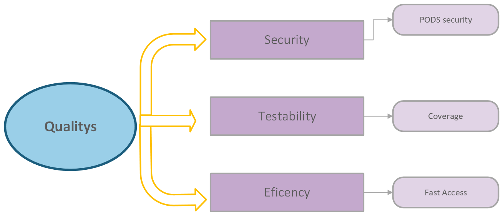

[[section-quality-scenarios]]
== Quality Requirements

=== Quality Tree

[role="arc42help"]
****

****

=== Quality Scenarios

[role="arc42help"]

==== Security
By saving on the SOLID PODs the information of the user and also by only having esential info on the database.

==== Testability / Coverage

Using Cucumber for testing and Codecov for code coverge we ensure the quality of the aplication.

==== Eficency
We need to ensure a fast conection and transaction between the user and the app.

